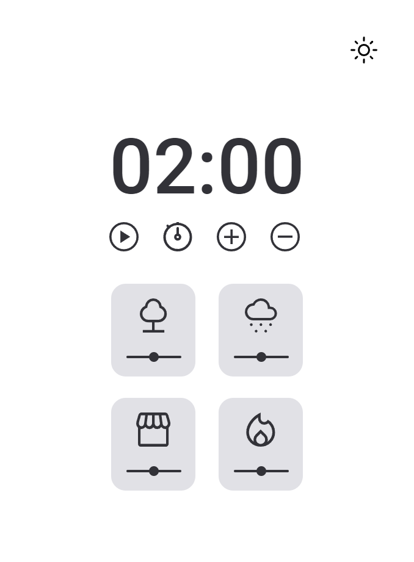
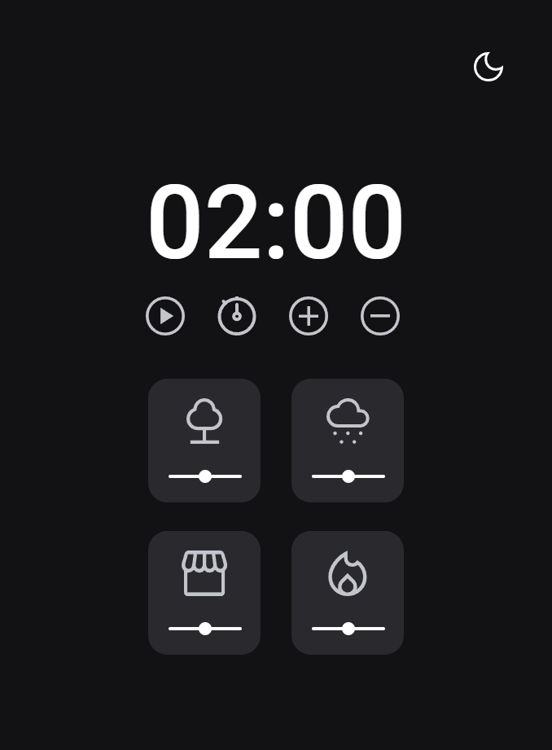

<h1 align="center"> Focus Timer 2.0</h1>

  <a href="#-technologies">Technologies</a>
  &nbsp;&nbsp;&nbsp;|&nbsp;&nbsp;&nbsp;
  <a href="#-functions">Functions</a>&nbsp;&nbsp;&nbsp;|&nbsp;&nbsp;&nbsp;
  <a href="#-project">Project</a>

 

 

## 🚀 Technologies

This project has been developed with the following technologies:

- HTML
- CSS
- JavaScript
- ES6(module)

## 🛠️ Functions

- Dark and light mode version.
- Stopwatch.
- Set a timer.
- Play a countdown.
- Pause the countdown.
- Stop and finish the countdown.
- Sound to warning that the time is end.
- Button to add or remove five minutes.
- Card with sounds from different climate.
- Volume bar to control card sounds

## 💻 Project

The Focus Timer 2.0 is a project of Explorer course from Rocketseat, an application that run a stopwatch and reproduce some climate sounds.
